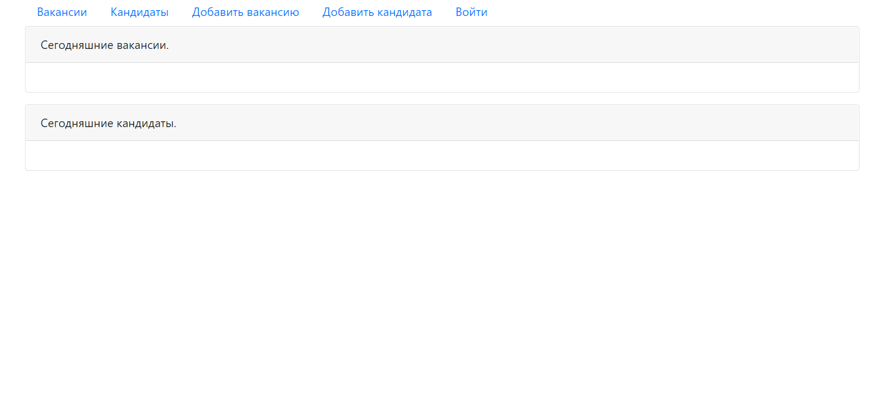
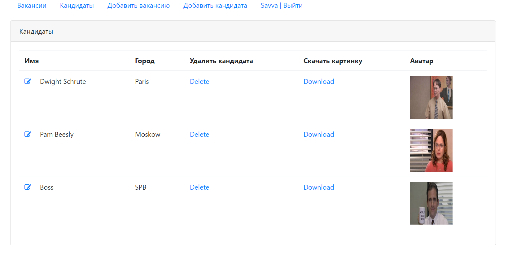
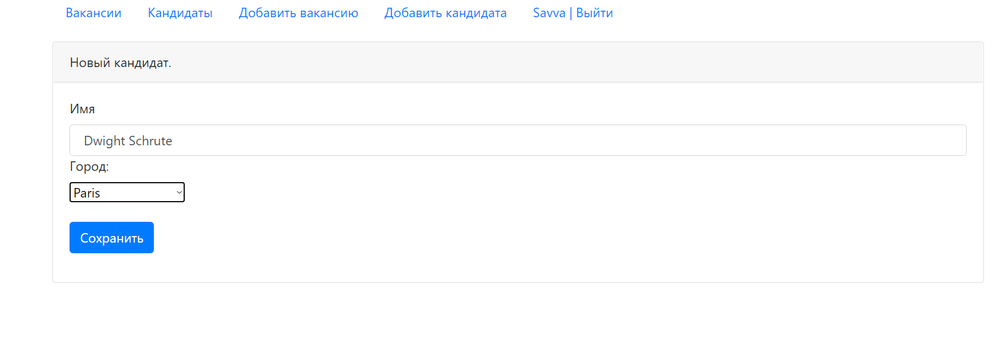
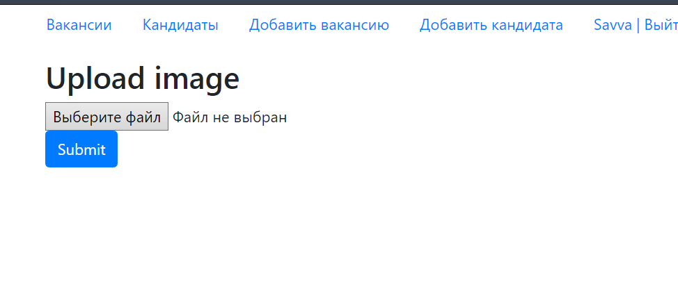
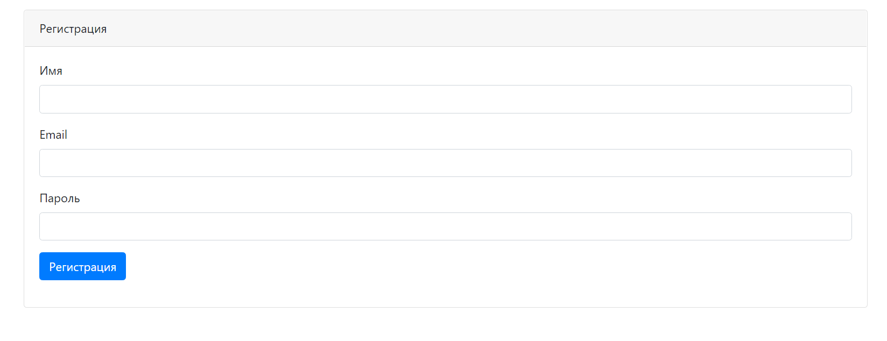

#job4j_dreamjob

**Great Web Applications for Job Seekers**

**Technologies used:**

Java, Maven, Servlets, JSP, jstl, JDBC, PostgreSQL, MVC Pattern, Mockito, Travis CI, HTML/CSS, JS,
jQuery, Ajax, JSON, Apache Tomcat.

**Demonstration of the application:**

